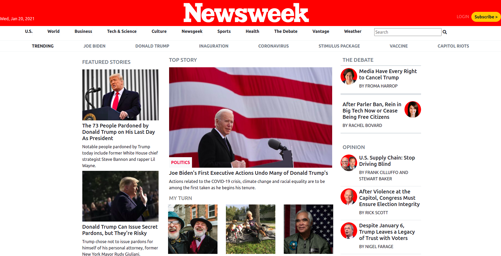

## Project 3 Microverse

# Clone of Newsweek website using Bootstrap
> This is a clone of the Newsweek archived by Webarchive. In this project we used bootstrap, flex, and fontawesome.

## Built With

- Html
- CSS
- Bootstrap
- Fontawesome
- Windows
- Linux

## Live Demo

[Live Demo Link](https://pountzas.github.io/Project-3-using-Bootstrap/)

To get a local copy up and running follow these simple example steps.

### Setup

- open your Terminal, go to the desired folder and write the following commands

- git init
- git clone https://github.com/pountzas/Project-2-Building-with-Responsive-Design.git review

👤 **Nikos Pountzas**

- GitHub: [@pountzas](https://github.com/pountzas)
- Twitter: [@pountzas20](https://twitter.com/pountzas20)
- LinkedIn: [LinkedIn](https://www.linkedin.com/in/nikos-pountzas-173ba4a8/)

👤 **Arthur Borges**

- GitHub: [@arthurborgesdev](https://github.com/arthurborgesdev)
- Twitter: [@arthurmoises](https://twitter.com/arthurmoises)
- LinkedIn: [Arthur Borges](https://www.linkedin.com/in/arthurmoises/)

## 🤝 Contributing

Contributions, issues, and feature requests are welcome!

Feel free to check the [issues page](https://github.com/pountzas/Project-3-using-Bootstrap/issues).

## Show your support

Give a ⭐️ if you like this project!

## 📝 License

MIT